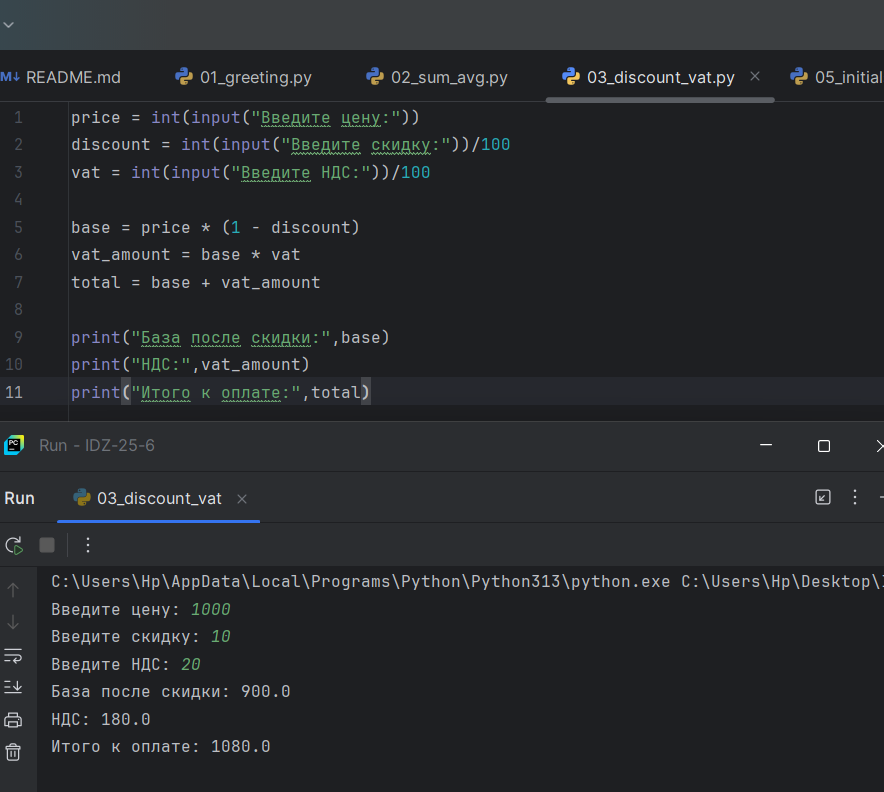

# Лаба 1

Задание 1-ое

```python
Name=str(input("Имя:"))
Age=int(input("Возраст:"))

print("Привет,",Name,"! Через год тебе будет",Age+1)
```


Задание 2-ое

```python
a=float(input('a:'))
b=float(input('b:'))

print ('sum=',a+b,';','avg=',(a+b)/2)
```


Задание 3-ое

```python
price = int(input("Введите цену:"))
discount = int(input("Введите скидку:"))/100
vat = int(input("Введите НДС:"))/100

base = price * (1 - discount)
vat_amount = base * vat
total = base + vat_amount

print("База после скидки:",base)
print("НДС:",vat_amount)
print("Итого к оплате:",total)
```



Задание 4-ое

```python
min = int(input("Mинуты:"))

print(f'{min//60}:{min%60}')
```


Задание 5-ое

```python
N = input ("ФИО:")
I = N.split()
initial=""
ll=2
for i in range(0,3):
    initial = initial + I[i][0]
    ll = len(I[i]) + ll
print("Инициалы:",initial.upper())
print("Длина (символов):",ll)
```


# Лаба 2