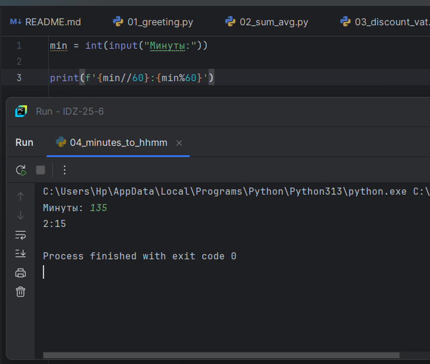
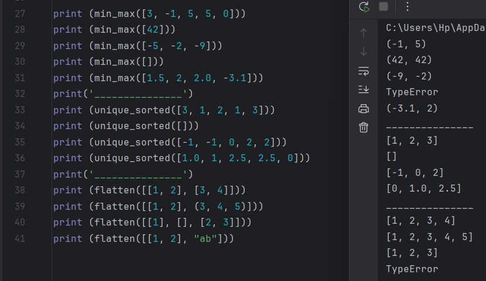
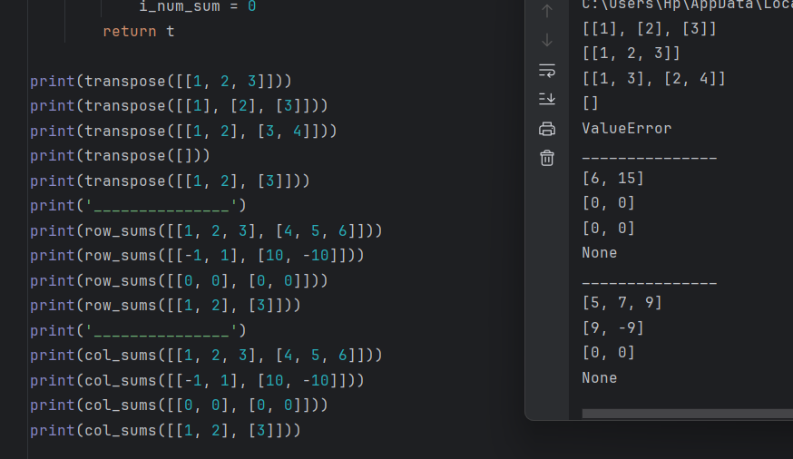
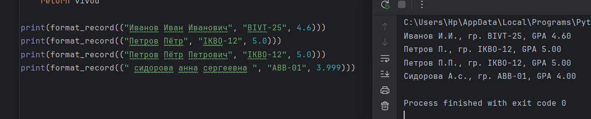

# Лаба 1

Задание 1-ое

```python
Name=str(input("Имя:"))
Age=int(input("Возраст:"))

print("Привет,",Name,"! Через год тебе будет",Age+1)
```


Задание 2-ое

```python
a=float(input('a:'))
b=float(input('b:'))

print ('sum=',a+b,';','avg=',(a+b)/2)
```


Задание 3-ое

```python
price = int(input("Введите цену:"))
discount = int(input("Введите скидку:"))/100
vat = int(input("Введите НДС:"))/100

base = price * (1 - discount)
vat_amount = base * vat
total = base + vat_amount

print("База после скидки:",base)
print("НДС:",vat_amount)
print("Итого к оплате:",total)
```


Задание 4-ое

```python
min = int(input("Mинуты:"))

print(f'{min//60}:{min%60}')
```



Задание 5-ое

```python
N = input ("ФИО:")
I = N.split()
initial=""
ll=2
for i in range(0,3):
    initial = initial + I[i][0]
    ll = len(I[i]) + ll
print("Инициалы:",initial.upper())
print("Длина (символов):",ll)
```


# Лаба 2

Задание 1-ое

```python
def min_max(nums):
    if nums == []:
        return ('TypeError')
    else:
        t = (min(nums) , max(nums))
    return t


def unique_sorted(nums):
    t = sorted(list(set(nums)))
    return t

def flatten(mat):
    t = list ()
    for i in mat:
        if type(i) == list or type(i) == tuple:
            t.extend(i)
        else:
            return ('TypeError')
    return (t)
```



Задание 2-ое

```python
def transpose(mat):
    if mat == []:
        return mat
    else:
        #Проверка на рванность
        l_mat = len(mat[0])
        ok = 1
        for i in mat:
            if len(i) != l_mat:
                ok = 0
            else:
                ok = 1
        #Проверка на рванность
        if ok == 1:

            trans = [[mat[j][i] for j in range(len(mat))] for i in range(len(mat[0]))]
            return trans
        else:
            return ('ValueError')


def row_sums(mat):
    # Проверка на рванность
    l_mat = len(mat[0])
    ok = 1
    for i in mat:
        if len(i) != l_mat:
            ok = 0
        else:
            ok = 1
    # Проверка на рванность
    if ok == 1:
        t = list()
        for i in mat:
            s = sum(i)
            t = t + [s]
        return t
    else: ('ValueError')


def col_sums(mat):
    # Проверка на рванность
    l_mat = len(mat[0])
    ok = 1
    for i in mat:
        if len(i) != l_mat:
            ok = 0
        else:
            ok = 1
    # Проверка на рванность
    if ok == 1:
        t = list()
        i_num_sum = 0
        for num in range(0, l_mat):
            for i in mat:
                i_num_sum = i_num_sum + i[num]

            t = t + [i_num_sum]
            i_num_sum = 0
        return t
```



Задание 3-е

```python
def format_record(rec):
    if len(rec) != 3: #Проверка: колличество элементов
        return ("ValueError")
    if type(rec[0]) != str or type(rec[1]) != str or type(rec[2]) != float: #Проверка: тип элементов
        return ("TypeError")

    Name_split = rec[0].split()
    vivod = Name_split[0].title() + ' ' + Name_split[1][0].upper() +'.'

    if len(Name_split) == 3:
        vivod += Name_split[2][0] + '., '
    else:
        vivod += (', ')


    vivod += 'гр. ' + rec[1] + ', GPA' + f'{round(rec[2],2):.2f}'
    return vivod
```



# Лаба 3

Задание 1-ое

```python

def normalize(text: str, *, casefold: bool = True, yo2e: bool = True):
    if casefold:
        text = text.casefold()
    if yo2e:
        text = text.replace('ё', 'е')

    if '\t' in text or '\r' in text or '\n' in text:
        text = text.replace('\t', ' ')
        text = text.replace('\r', ' ')
        text = text.replace('\n', ' ')

    s = text.split()
    itog = ''
    for i in s:
        itog = itog + ' ' + str(i)

    itog = itog.strip()

    return itog

def tokenize(text: str):
    text = normalize(text)

    pct_to_rplc = [',', '.', '!', '?', ';', ':', '(', ')', '[', ']', '{', '}', '"', "'"]

    for rep in pct_to_rplc:
        text = text.replace(rep, ' ')

    text_split = text.split()

    itog = list()

    for el in text_split:
        ok = 1
        for smbl in el:
            if smbl.isalnum():
                ok = 1
            else:
                ok = 0

        if ok == 1:
            itog = itog + [el]


    return itog

def count_freq(tokens: list[str]):
    uniq = list(set(tokens))

    l = list()

    for el in uniq:
        kort = (el, tokens.count(el))
        l = l + [kort]

    d = dict(l)

    return d

def top_n(freq: dict[str, int], n: int = 5):

    sorted_freq = sorted(freq.items(), key=lambda item: item[1], reverse = True)

    l = list(sorted_freq)

    alph = []
    alph_sort = []

    for el_in_l in range(0, len(l) - 2):
        if l[el_in_l][1] == l[el_in_l + 1][1]:
            alph = [l[el_in_l]] + [l[el_in_l + 1]]
            del l[el_in_l]
            del l[el_in_l]
            alph_sort = sorted(alph)

            l = alph_sort + l

    itog = l[:n]

    return itog
```


Задание 2-ое

```python
from src.lib.text import *

t = "Привет, мир! Привет!!!"

print("Всего слов:", len(tokenize(t)))
print("Уникальных слов:", len(count_freq(tokenize(t))))
print("Топ-5:")

for top_num in range(0, len(count_freq(tokenize(t)))):
    print ( top_n(count_freq(tokenize(t)), 5)[top_num][0],': ',top_n(count_freq(tokenize(t)), 5)[top_num][1], sep='')
```


# Лaба 4

Задание 1-ое
```python
import csv
from pathlib import Path


def read_text(path: str | Path, encoding: str = "utf-8") -> str:
    with open(path, 'r', encoding=encoding) as f:
        return f.read()


def write_csv(rows: list[tuple | list], path: str | Path, header: tuple[str, ...] | None = None) -> None:
    if rows and len(set(len(row) for row in rows)) != 1:
        raise ValueError("Все строки должны иметь одинаковую длину")

    with open(path, 'w', newline='', encoding='utf-8') as f:
        writer = csv.writer(f)
        if header:
            writer.writerow(header)
        writer.writerows(rows)


if __name__ == "__main__":
    try:
        txt = read_text('src/lab04/Text.test')
        print(f"Прочитано: {txt}")
    except FileNotFoundError:
        print("Файл text.test не найден")

    write_csv([("word", "count"), ("test", 3)], "table.csv")
    print("файл csv создан!")
```

Задание 2-ое

```python