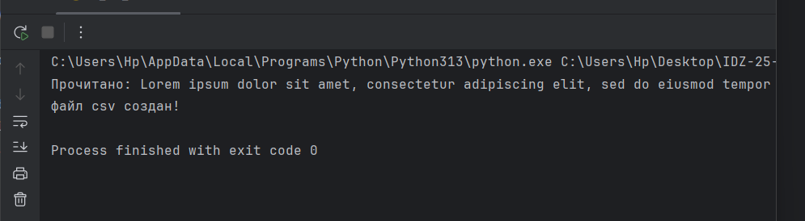
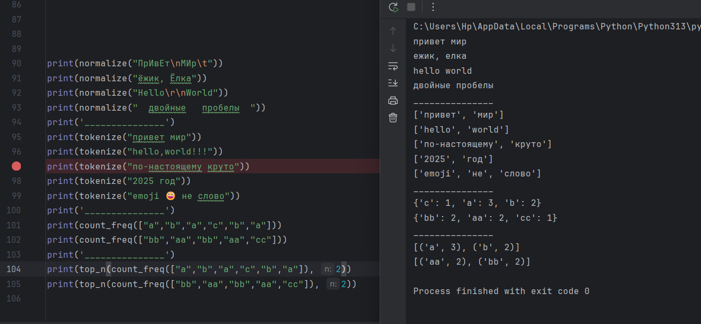
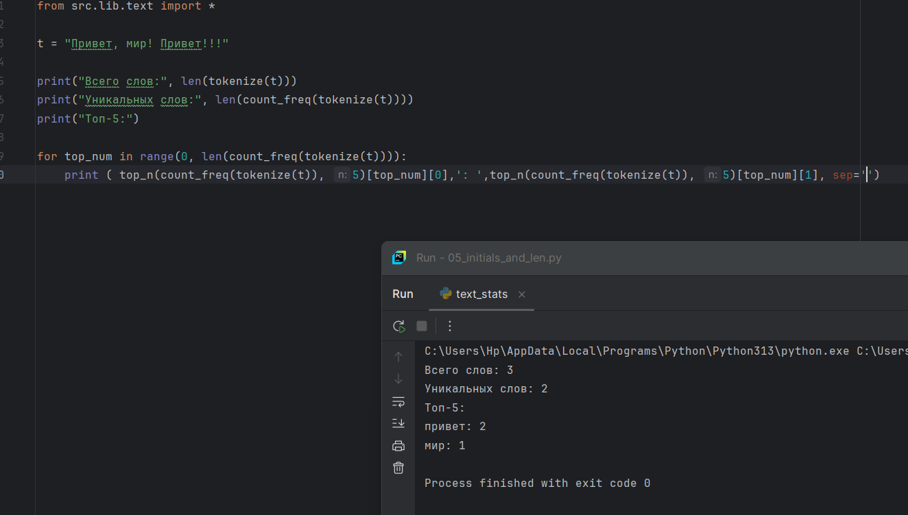
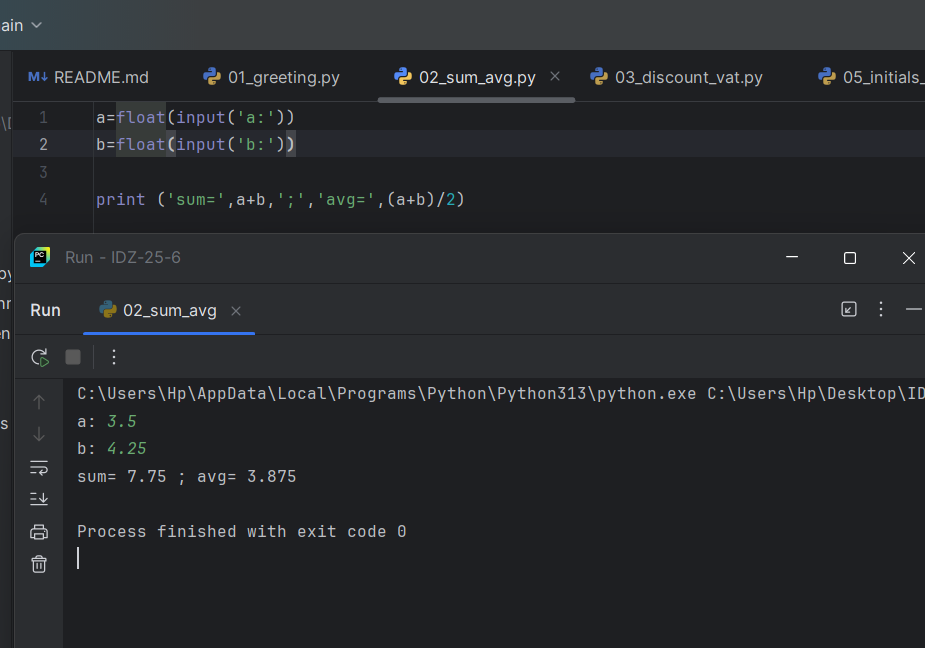

# Лаба 7

# Лаба 6

Cli_text.py
```python
import argparse
from pathlib import Path

import sys
import os

sys.path.insert(0, os.path.join(os.path.dirname(__file__), '..', '..'))

try:
    from src.lib.text import normalize, tokenize, top_n, count_freq
except ImportError as e:
    sys.exit(f"Ошибка импорта: {e}")

def main():
    parser = argparse.ArgumentParser(description="CLI‑утилиты лабораторной №6")
    subparsers = parser.add_subparsers(dest="command")

    # подкоманда cat
    cat_parser = subparsers.add_parser("cat", help="Вывести содержимое файла")
    cat_parser.add_argument("--input", required=True)
    cat_parser.add_argument("-n", action="store_true", help="Нумеровать строки")

    # подкоманда stats
    stats_parser = subparsers.add_parser("stats", help="Частоты слов")
    stats_parser.add_argument("--input", required=True)
    stats_parser.add_argument("--top", type=int, default=5)

    args = parser.parse_args()

    file_path = Path(args.input)
    if not file_path.exists():
        parser.error(f"Файл '{args.input}' не найден")


    if args.command == "cat":
        try:
            with file_path.open("r", encoding="utf-8") as f:
                for i, line in enumerate(f, start=1):
                    line = line.rstrip("\n")
                    if args.n:
                        print(f"{i}: {line}")
                    else:
                        print(line)
        except Exception as e:
            parser.error(f"Ошибка при чтении файла: {e}")

    elif args.command == "stats":
        try:
            with file_path.open("r", encoding="utf-8") as f:
                text = f.read()

            normalized = normalize(text)
            words = tokenize(normalized)
            freq = count_freq(words)
            top_words = top_n(freq, args.top)

            if not top_words:
                print("Слова не найдены в файле")
                return

            print(f"Топ {args.top} слов:")
            for word, count in top_words:
                print(f"{word}: {count}")

        except Exception as e:
            parser.error(f"Ошибка при чтении файла: {e}")

    else:
        parser.print_help()

if __name__ == "__main__":
    main()

```


Меню помощи Help:

Cli_convert.py
```python
import argparse
from pathlib import Path

import sys
import os

sys.path.insert(0, os.path.join(os.path.dirname(__file__), '..', '..'))

try:
    from src.lab05.json_csv import json_to_csv
    from src.lab05.cvs_xlsx import csv_to_xlsx
except ImportError as e:
    sys.exit(f"Ошибка импорта: {e}")

def main():
    parser = argparse.ArgumentParser(description="Конвертер JSON↔CSV, CSV→XLSX")
    sub = parser.add_subparsers(dest="cmd")

    # json → csv
    json2csv_parser = sub.add_parser("json2csv")
    json2csv_parser.add_argument("--in", dest="input", required=True, help="Путь к входному JSON")
    json2csv_parser.add_argument("--out", dest="output", required=True, help="Путь к выходному CSV")

    # csv → json
    csv2json_parser = sub.add_parser("csv2json")
    csv2json_parser.add_argument("--in", dest="input", required=True, help="Путь к входному CSV")
    csv2json_parser.add_argument("--out", dest="output", required=True, help="Путь к выходному JSON")

    # csv → xlsx
    csv2xlsx_parser = sub.add_parser("csv2xlsx")
    csv2xlsx_parser.add_argument("--in", dest="input", required=True, help="Путь к входному CSV")
    csv2xlsx_parser.add_argument("--out", dest="output", required=True, help="Путь к выходному XLSX")

    args = parser.parse_args()

    input_path = Path(args.input)
    if not input_path.exists():
        parser.error(f"Входной файл '{args.input}' не найден")

    if args.cmd == "json2csv":
        json_to_csv(args.input, args.output)
    elif args.cmd == "csv2json":
        csv_to_json(args.input, args.output)
    elif args.cmd == "csv2xlsx":
        csv_to_xlsx(args.input, args.output)
    else:
        parser.print_help()


if __name__ == "__main__":
    main()
```
Меню помощи Help:

# Лаба 5

Задание А 
```python
from pathlib import Path
import json
import csv

def json_to_csv(json_path, csv_path):
    json_file = Path(json_path)
    csv_file = Path(csv_path)

    if not json_file.exists():
        raise FileNotFoundError("Файл не найден")

    if json_file.suffix.lower() != ".json":
        raise ValueError("Неверный формат файла")
    if csv_file.suffix.lower() != ".csv":
        raise ValueError("Неверный формат файла")


    with json_file.open('r', encoding="utf-8") as f:
        try:
            data = json.load(f)
        except json.JSONDecodeError:
            raise ValueError("Некорректный JSON-файл")
    if not isinstance(data, list) or not all(isinstance(value, dict) for value in data):
        raise ValueError("Ожидается список словарей")
    if not data:
        raise ValueError("Пустой JSON")

    header = list(data[0].keys())
    with csv_file.open("w", newline="", encoding="utf-8") as f:
        writer = csv.DictWriter(f, fieldnames=header)
        writer.writeheader()
        for row in data:
            writer.writerow({k: row.get(k, "") for k in header})

def csv_to_json(csv_path, json_path):
    json_file = Path(json_path)
    csv_file = Path(csv_path)

    if not json_file.exists():
        raise FileNotFoundError("Файл не найден")

    if json_file.suffix.lower() != ".json":
        raise ValueError("Неверный формат файла")
    if csv_file.suffix.lower() != ".csv":
        raise ValueError("Неверный формат файла")


    with csv_file.open(encoding="utf-8") as f:
        reader = csv.DictReader(f)
        if reader.fieldnames is None:
            raise ValueError("CSV не содержит заголовок")
        data = [row for row in reader]
    if not data:
        raise ValueError("Пустой CSV")

    with json_file.open("w", encoding="utf-8") as f:
        json.dump(data, f, ensure_ascii=False, indent=2)
```


Задание B
```python
from pathlib import Path
import csv
from openpyxl import Workbook

def csv_to_xlsx(csv_path, xlsx_path):
    csv_file = Path(csv_path)
    xlsx_file = Path(xlsx_path)

    if csv_file.suffix.lower() != ".csv":
        raise ValueError("Неверный формат файла")
    if xlsx_file.suffix.lower() != ".xlsx":
        raise ValueError("Неверный формат файла")

    if not csv_file.exists():
        raise FileNotFoundError("Файл CSV не найден")
    if not xlsx_file.exists():
        raise FileNotFoundError("Файл XLSX не найден")

    with csv_file.open("r", encoding="utf-8", newline="") as f:
        reader = csv.reader(f)
        rows = list(reader)

    if not rows or all(not any(row) for row in rows):
        raise ValueError("Пустой CSV или неподдерживаемая структура")

    wb = Workbook()
    ws = wb.active
    ws.title = "Sheet1"

    for row in rows:
        ws.append(row)

    for col in ws.columns:
        max_len = max(len(str(cell.value or "")) for cell in col)
        col_letter = col[0].column_letter
        ws.column_dimensions[col_letter].width = max(max_len + 2, 8)

    wb.save(xlsx_file)
```


# Лaба 4

Текст в тестовом файле:
"Lorem ipsum dolor sit amet, consectetur adipiscing elit, sed do eiusmod tempor incididunt ut labore et dolore magna aliqua. Ut enim ad minim veniam, quis nostrud exercitation ullamco laboris nisi ut aliquip ex ea commodo consequat. Duis aute irure dolor in reprehenderit in voluptate velit esse cillum dolore eu fugiat nulla pariatur. Excepteur sint occaecat cupidatat non proident, sunt in culpa qui officia deserunt mollit anim id est laborum".

Задание 1-ое
```python
import csv
from pathlib import Path


def read_text(path: str | Path, encoding: str = "utf-8") -> str:
    with open(path, 'r', encoding=encoding) as f:
        return f.read()


def write_csv(rows: list[tuple | list], path: str | Path, header: tuple[str, ...] | None = None) -> None:
    if rows and len(set(len(row) for row in rows)) != 1:
        raise ValueError("Все строки должны иметь одинаковую длину")

    with open(path, 'w', newline='', encoding='utf-8') as f:
        writer = csv.writer(f)
        if header:
            writer.writerow(header)
        writer.writerows(rows)


if __name__ == "__main__":
    try:
        txt = read_text('src/lab04/Text.test')
        print(f"Прочитано: {txt}")
    except FileNotFoundError:
        print("Файл text.test не найден")

    write_csv([("word", "count"), ("test", 3)], "table.csv")
    print("файл csv создан!")
```



Задание 2-ое

```python
import sys, os, csv
from collections import Counter

sys.path.insert(0, os.path.join(os.path.dirname(__file__), '..', '..'))

try:
    from src.lib.text import normalize, tokenize
except ImportError as e:
    sys.exit(f"Ошибка импорта: {e}")

def main():
    input_file = 'C:\\Users\\Hp\\Desktop\\IDZ-25-6\\src\\lab04\\text.test'
    output_file = 'src\\lab04\\table.csv'

    try:
        with open(input_file, 'r', encoding='utf-8') as f:
            text = f.read()
        if not text.strip():
            sys.exit("Файл пустой")
    except Exception as e:
        sys.exit(f"Ошибка чтения {input_file}: {e}")

    try:
        normalized = normalize(text)
        words = tokenize(normalized)
        if not words:
            sys.exit("После обработки слов не найдено")
        word_freq = Counter(words)
    except Exception as e:
        sys.exit(f"Ошибка обработки текста: {e}")

    try:
        os.makedirs(os.path.dirname(output_file), exist_ok=True)
        with open(output_file, 'w', encoding='utf-8', newline='') as f:
            writer = csv.writer(f)
            writer.writerow(['word', 'count'])
            for word, count in sorted(word_freq.items(), key=lambda x: (-x[1], x[0])):
                writer.writerow([word, count])
    except Exception as e:
        sys.exit(f"Ошибка сохранения {output_file}: {e}")

    top5 = sorted(word_freq.items(), key=lambda x: (-x[1], x[0]))[:5]
    print(f"Всего слов: {len(words)}")
    print(f"Уникальных слов: {len(word_freq)}")
    print('Топ 5:')
    k = 0
    print(f'{"слово:":^15} |{"частота":^15}')
    print(f"{'----------' * 3:^30}")
    for word, counts in top5:
        if k == 5:
            break
        k += 1
        print(f'{word:^15} |{counts:^15}')


if __name__ == "__main__":
    main()
```


# Лаба 3

Задание 1-ое

```python

def normalize(text: str, *, casefold: bool = True, yo2e: bool = True):
    if casefold:
        text = text.casefold()
    if yo2e:
        text = text.replace('ё', 'е')

    if '\t' in text or '\r' in text or '\n' in text:
        text = text.replace('\t', ' ')
        text = text.replace('\r', ' ')
        text = text.replace('\n', ' ')

    s = text.split()
    itog = ''
    for i in s:
        itog = itog + ' ' + str(i)

    itog = itog.strip()

    return itog

def tokenize(text: str):
    text = normalize(text)

    pct_to_rplc = [',', '.', '!', '?', ';', ':', '(', ')', '[', ']', '{', '}', '"', "'"]

    for rep in pct_to_rplc:
        text = text.replace(rep, ' ')

    text_split = text.split()

    itog = list()

    for el in text_split:
        ok = 1
        for smbl in el:
            if smbl.isalnum():
                ok = 1
            else:
                ok = 0

        if ok == 1:
            itog = itog + [el]


    return itog

def count_freq(tokens: list[str]):
    uniq = list(set(tokens))

    l = list()

    for el in uniq:
        kort = (el, tokens.count(el))
        l = l + [kort]

    d = dict(l)

    return d

def top_n(freq: dict[str, int], n: int = 5):

    sorted_freq = sorted(freq.items(), key=lambda item: item[1], reverse = True)

    l = list(sorted_freq)

    alph = []
    alph_sort = []

    for el_in_l in range(0, len(l) - 2):
        if l[el_in_l][1] == l[el_in_l + 1][1]:
            alph = [l[el_in_l]] + [l[el_in_l + 1]]
            del l[el_in_l]
            del l[el_in_l]
            alph_sort = sorted(alph)

            l = alph_sort + l

    itog = l[:n]

    return itog
```


Задание 2-ое

```python
from src.lib.text import *

t = "Привет, мир! Привет!!!"

print("Всего слов:", len(tokenize(t)))
print("Уникальных слов:", len(count_freq(tokenize(t))))
print("Топ-5:")

for top_num in range(0, len(count_freq(tokenize(t)))):
    print ( top_n(count_freq(tokenize(t)), 5)[top_num][0],': ',top_n(count_freq(tokenize(t)), 5)[top_num][1], sep='')
```




# Лаба 2

Задание 1-ое

```python
def min_max(nums):
    if nums == []:
        return ('TypeError')
    else:
        t = (min(nums) , max(nums))
    return t


def unique_sorted(nums):
    t = sorted(list(set(nums)))
    return t

def flatten(mat):
    t = list ()
    for i in mat:
        if type(i) == list or type(i) == tuple:
            t.extend(i)
        else:
            return ('TypeError')
    return (t)
```


Задание 2-ое

```python
def transpose(mat):
    if mat == []:
        return mat
    else:
        #Проверка на рванность
        l_mat = len(mat[0])
        ok = 1
        for i in mat:
            if len(i) != l_mat:
                ok = 0
            else:
                ok = 1
        #Проверка на рванность
        if ok == 1:

            trans = [[mat[j][i] for j in range(len(mat))] for i in range(len(mat[0]))]
            return trans
        else:
            return ('ValueError')


def row_sums(mat):
    # Проверка на рванность
    l_mat = len(mat[0])
    ok = 1
    for i in mat:
        if len(i) != l_mat:
            ok = 0
        else:
            ok = 1
    # Проверка на рванность
    if ok == 1:
        t = list()
        for i in mat:
            s = sum(i)
            t = t + [s]
        return t
    else: ('ValueError')


def col_sums(mat):
    # Проверка на рванность
    l_mat = len(mat[0])
    ok = 1
    for i in mat:
        if len(i) != l_mat:
            ok = 0
        else:
            ok = 1
    # Проверка на рванность
    if ok == 1:
        t = list()
        i_num_sum = 0
        for num in range(0, l_mat):
            for i in mat:
                i_num_sum = i_num_sum + i[num]

            t = t + [i_num_sum]
            i_num_sum = 0
        return t
```


Задание 3-е

```python
def format_record(rec):
    if len(rec) != 3: #Проверка: колличество элементов
        return ("ValueError")
    if type(rec[0]) != str or type(rec[1]) != str or type(rec[2]) != float: #Проверка: тип элементов
        return ("TypeError")

    Name_split = rec[0].split()
    vivod = Name_split[0].title() + ' ' + Name_split[1][0].upper() +'.'

    if len(Name_split) == 3:
        vivod += Name_split[2][0] + '., '
    else:
        vivod += (', ')


    vivod += 'гр. ' + rec[1] + ', GPA' + f'{round(rec[2],2):.2f}'
    return vivod
```


# Лаба 1

Задание 1-ое

```python
Name=str(input("Имя:"))
Age=int(input("Возраст:"))

print("Привет,",Name,"! Через год тебе будет",Age+1)
```


Задание 2-ое

```python
a=float(input('a:'))
b=float(input('b:'))

print ('sum=',a+b,';','avg=',(a+b)/2)
```



Задание 3-ое

```python
price = int(input("Введите цену:"))
discount = int(input("Введите скидку:"))/100
vat = int(input("Введите НДС:"))/100

base = price * (1 - discount)
vat_amount = base * vat
total = base + vat_amount

print("База после скидки:",base)
print("НДС:",vat_amount)
print("Итого к оплате:",total)
```


Задание 4-ое

```python
min = int(input("Mинуты:"))

print(f'{min//60}:{min%60}')
```


Задание 5-ое

```python
N = input ("ФИО:")
I = N.split()
initial=""
ll=2
for i in range(0,3):
    initial = initial + I[i][0]
    ll = len(I[i]) + ll
print("Инициалы:",initial.upper())
print("Длина (символов):",ll)
```


